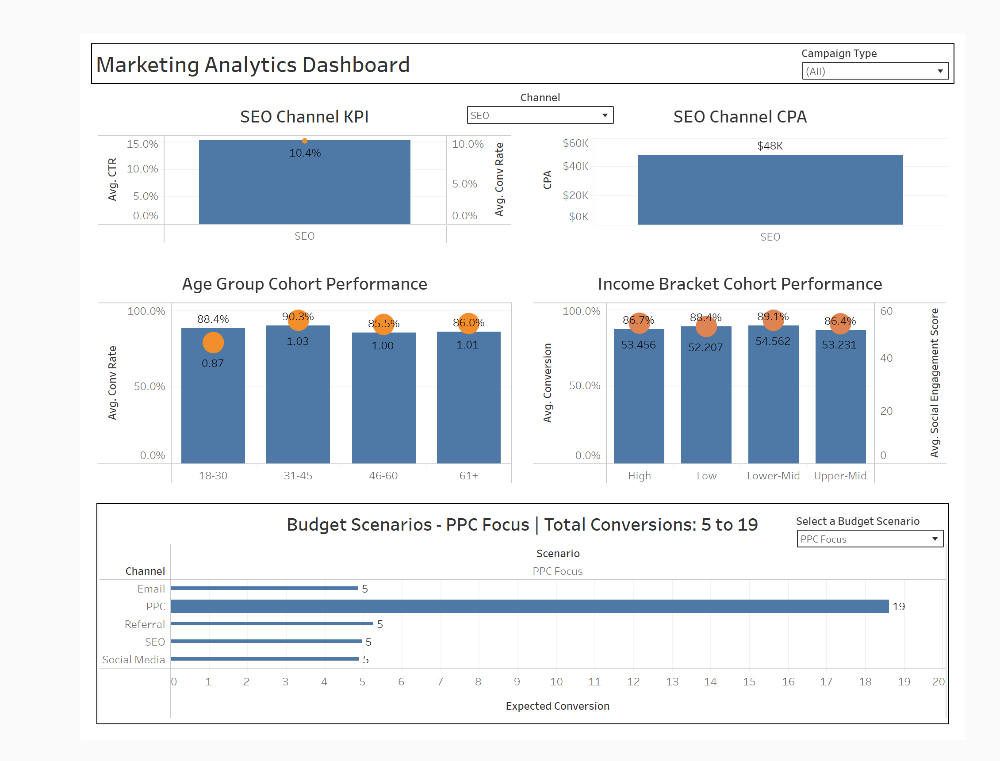

# Marketing Campaign Performance & Optimization Case Study

This repository contains an end-to-end analysis of a digital marketing campaign dataset to identify conversion drivers and recommend optimal budget allocations.

## Project Overview

In this case study, we analyze a digital marketing campaign dataset from Kaggle to uncover the key factors driving customer conversions for a mid-sized e-commerce brand. Through exploratory analysis, predictive modeling, and what-if budget simulations, we quantify channel performance, evaluate engagement metrics, and recommend the optimal marketing mix under a fixed budget.

## Objectives

- **Quantify Channel Performance:** Compute CTR, Conversion Rate, Ad Spend and Cost per Acquisition (CPA) for each campaign channel.  
- **Segment Audience Cohorts:** Create demographic (AgeGroup, IncomeBracket) and engagement (EmailEngagementRate, SocialEngagementScore) segments to identify high-value users.  
- **Build & Evaluate Models:** Train and compare Logistic Regression and Random Forest classifiers to predict conversion likelihood and assess feature importance.  
- **Simulate Budget Scenarios:** Develop a simulation function to estimate conversions for different spend allocations and recommend the mix that maximizes ROI under a $50 K budget.  


## Dataset
The dataset is available on Kaggle:
https://www.kaggle.com/datasets/rabieelkharoua/predict-conversion-in-digital-marketing-dataset

## Requirements
Install the required Python packages:
```bash
pip install -r requirements.txt
```

## Notebook
Open and run `marketing_campaign_analysis.ipynb` to perform:
1. Data Loading & Initial Exploration  
2. Data Cleaning & Preprocessing  
3. Exploratory Data Analysis (EDA)  
4. Predictive Modeling (Logistic Regression & Random Forest)  
5. Budget Allocation Simulation & Recommendations  

## Screenshots

### Channel‐Level Performance  


### IncomeBracket Cohort Analysis  


## Intereactive Tableau Dashboard



**[Click here to view the interactive dashboard on Tableau Public](https://public.tableau.com/views/MarketingAnalyticsDashboard_17496729206370/Dashboard1?:language=en-US&:sid=&:redirect=auth&:display_count=n&:origin=viz_share_link)**


## Key Insights
- **Social Media** delivers the highest conversion rate (0.1066) and the lowest cost per acquisition (~$46.6K).  
- **PPC** has the highest click-through rate (0.158) and, when allocated 40% of the budget, maximizes conversions (~38.6 per $50K).  
- **Behavioral Metrics**: TimeOnSite and PagesPerVisit are the strongest predictors of conversion.  
- **Cohort Uniformity**: AgeGroup and IncomeBracket show minimal variation in conversion and engagement metrics.  
- **Model Performance**:  
  - Scaled Logistic Regression: ROC-AUC ≈ 0.78, balanced precision/recall.  
  - Random Forest: ROC-AUC ≈ 0.80, high recall for converters but low recall for non-converters.

## Usage
Adjust budget scenarios in the "Budget Simulation" section of the notebook to test different spend allocations and expected conversion outcomes.
-----

This project is part of a broader portfolio showcasing real-world data analysis. Visit [My GitHub Portfolio](https://github.com/dataworksbyj/real-world-data-case-studies) to explore more case studies.
